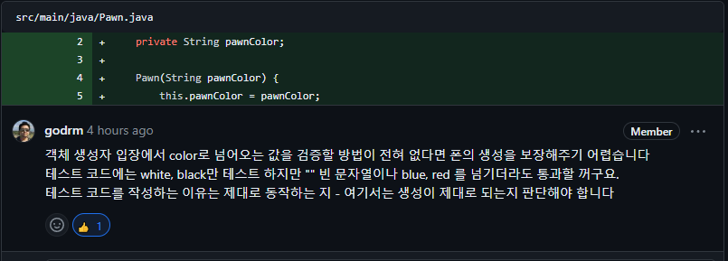

# be-chess

2024 마스터즈 체스 프로젝트

## 주의할 점

- Lucas 컨텐츠의 내용을 공개된 저장소 또는 웹에 올리는 것은 엄격하게 금지합니다.
- 커밋메시지는 한글로 두 줄 이상 작성합니다.
- MVC 패턴은 사용하지 않습니다.

---

## Step - 1 코드 리뷰 리팩토링

### 1) 프로젝트 의존성 관리 [ gitignore 설정 ]


### ❗ 문제점

- ```Gradle Build```에 사용되는 방법은 ```Gradle Wrapper```을 사용하는 것인데, ```.gitignore```
  에서 ```gradlew.bat```, ```gradlew```. ```gradle```을 ignore을 하여 gradle 버전 관리가 정상적으로 되지 않는 문제 발생

### ⭕️ 해결

- ```Gradle Wrapper 구조```
    - gradlew.bat
        - 윈도우용 wrapper 실행 스크립트이다.

    - gradlew
        - 유닉스용 wrapper 실행 스크립트이다. 컴파일, 빌드 등을 하는 경우 사용한다. ./gradlew {task} 형태로 실행한다.

    - gradle/wrapper/gradle-wrapper.jar
        - Wrapper 파일이다. 실행 스크립트가 동작하면 Wrapper에 맞는 환경을 로컬 캐시에 다운로드 받은 뒤에 실제 명령에 해당하는 task를 실행한다.

    - gradle/wrapper/gradle-wrapper.properties
        - Gradle Wrapper 설정파일이다.

> 따라서, gradle-wrapper를 통해 버전 관리가 이루어져야 한다.

- ```.gitignore```파일을 수정하여 해결

```
# Gradle
.gradle
**/build/
!src/**/build/

...

# Avoid ignoring Gradle wrapper jar file (.jar files 이 무시되기 때문)
!gradle-wrapper.jar

...

# Avoid ignore Gradle wrappper properties
!gradle-wrapper.properties
```

## 2) chess.pieces.Pawn Test 클래스에서의 상수 선언


### ❗ 문제점

- 상수 ```white```, ```black```이 단순히 테스트만을 위한 코드가 되어버리는 문제.

### ⭕️ 해결

- 폰의 색은 ```white``` 혹은 ```black```만 되는 것을 가정하자!
- ```white```, ```black```값을 ```chess.pieces.Pawn 클래스```에서 상수 처리

```
public class chess.pieces.Pawn {

private final static String WHITE_COLOR = "white";
private final static String BLACK_COLOR = "black";

...
}
```

- white나 black 값이 아니라면 예외 처리를 하도록 구현 [아래에 계속]

## 3) chess.pieces.Pawn 객체 생성 예외 처리



### ❗ 문제점

- chess.pieces.Pawn 객체가 생성될 때, 단순히 ```pawnColor```에 색상값만 주입해주기 때문에 ```chess.pieces.Pawn 객체```의 생성을 보장할 수 없는 문제 발생

### ⭕️ 해결

- ```setPawnColor```메소드를 통해 클래스를 생성 및 예외 처리
- 생성 시에 예외를 던지도록 구현하여, 객체 폰의 생성을 보장해줄 수 있게 해결하였다.

```
chess.pieces.Pawn(String pawnColor) {
setPawnColor(pawnColor);
}
```

```
private void setPawnColor(String pawnColor) {
        String inputPawnColor = pawnColor.toLowerCase().replace(" ", "");

        if (!inputPawnColor.equals(WHITE_COLOR) && !inputPawnColor.equals(BLACK_COLOR)) {
            throw new IllegalArgumentException("[ERROR] 폰의 색은 white, black 색상만 가능합니다");
        }
        this.pawnColor = inputPawnColor;
    }
```


