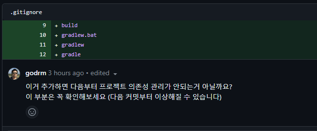
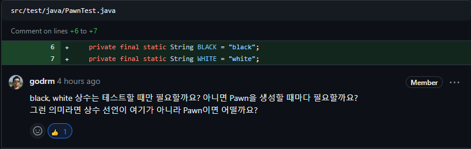
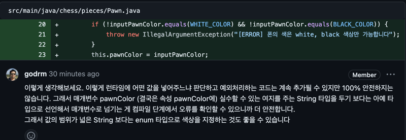
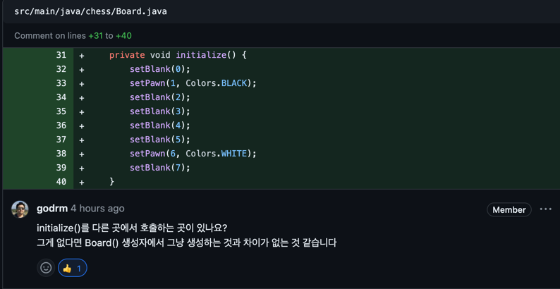
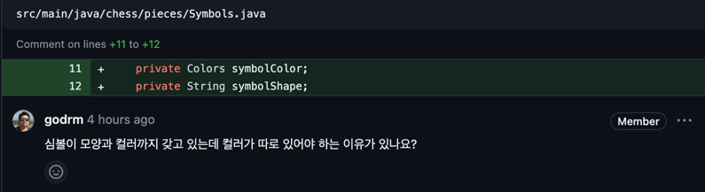
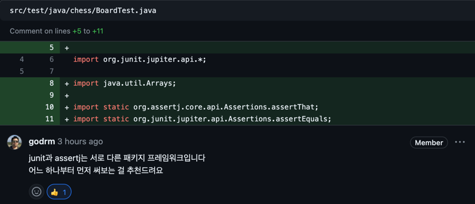
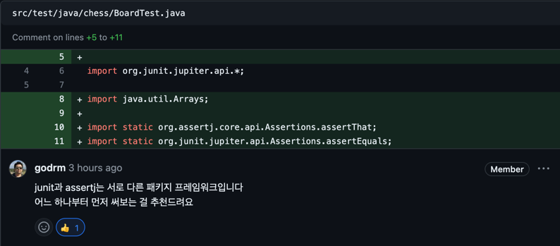

# be-chess

2024 마스터즈 체스 프로젝트

## 주의할 점

- Lucas 컨텐츠의 내용을 공개된 저장소 또는 웹에 올리는 것은 엄격하게 금지합니다.
- 커밋메시지는 한글로 두 줄 이상 작성합니다.
- MVC 패턴은 사용하지 않습니다.

---

## Step - 1 코드 리뷰 리팩토링

### 1) 프로젝트 의존성 관리 [ gitignore 설정 ]



### ❗ 문제점

- ```Gradle Build```에 사용되는 방법은 ```Gradle Wrapper```을 사용하는 것인데, ```.gitignore```
  에서 ```gradlew.bat```, ```gradlew```. ```gradle```을 ignore을 하여 gradle 버전 관리가 정상적으로 되지 않는 문제 발생

### ⭕️ 해결

- ```Gradle Wrapper 구조```
    - gradlew.bat
        - 윈도우용 wrapper 실행 스크립트이다.

    - gradlew
        - 유닉스용 wrapper 실행 스크립트이다. 컴파일, 빌드 등을 하는 경우 사용한다. ./gradlew {task} 형태로 실행한다.

    - gradle/wrapper/gradle-wrapper.jar
        - Wrapper 파일이다. 실행 스크립트가 동작하면 Wrapper에 맞는 환경을 로컬 캐시에 다운로드 받은 뒤에 실제 명령에 해당하는 task를 실행한다.

    - gradle/wrapper/gradle-wrapper.properties
        - Gradle Wrapper 설정파일이다.

> 따라서, gradle-wrapper를 통해 버전 관리가 이루어져야 한다.

- ```.gitignore```파일을 수정하여 해결

```
# Gradle
.gradle
**/build/
!src/**/build/

...

# Avoid ignoring Gradle wrapper jar file (.jar files 이 무시되기 때문)
!gradle-wrapper.jar

...

# Avoid ignore Gradle wrappper properties
!gradle-wrapper.properties
```

## 2) chess.pieces.Pawn Test 클래스에서의 상수 선언



### ❗ 문제점

- 상수 ```white```, ```black```이 단순히 테스트만을 위한 코드가 되어버리는 문제.

### ⭕️ 해결

- 폰의 색은 ```white``` 혹은 ```black```만 되는 것을 가정하자!
- ```white```, ```black```값을 ```chess.pieces.Pawn 클래스```에서 상수 처리

```
public class chess.pieces.Pawn {

private final static String WHITE_COLOR = "white";
private final static String BLACK_COLOR = "black";

...
}
```

- white나 black 값이 아니라면 예외 처리를 하도록 구현 [아래에 계속]

## 3) chess.pieces.Pawn 객체 생성 예외 처리


### ❗ 문제점

- chess.pieces.Pawn 객체가 생성될 때, 단순히 ```pawnColors```에 색상값만 주입해주기 때문에 ```chess.pieces.Pawn 객체```의 생성을 보장할 수 없는 문제 발생

### ⭕️ 해결

- ```setPawnColor```메소드를 통해 클래스를 생성 및 예외 처리
- 생성 시에 예외를 던지도록 구현하여, 객체 폰의 생성을 보장해줄 수 있게 해결하였다.

```
chess.pieces.Pawn(String pawnColors) {
setPawnColor(pawnColors);
}
```

```
private void setPawnColor(String pawnColors) {
        String inputPawnColor = pawnColors.toLowerCase().replace(" ", "");

        if (!inputPawnColor.equals(WHITE_COLOR) && !inputPawnColor.equals(BLACK_COLOR)) {
            throw new IllegalArgumentException("[ERROR] 폰의 색은 white, black 색상만 가능합니다");
        }
        this.pawnColors = inputPawnColor;
    }
```

---

## Step - 2 코드 리뷰 리팩토링

### 1) Pawn Color 값의 String Type 안정성



### ❗ 문제점

```
public final static String WHITE_COLOR = "white";
public final static String BLACK_COLOR = "black";

private String pawnColors;
```

- ```Colors```값을 String으로 선언해주어 생성자로 넘길 때 100% 안전성을 보장할 수 없다는 문제점 발생

```
* enum으로 선언
compile 단계에서 그냥 Pawn(RAINBOW) 해버리면 아예 컴파일 에러!

* String으로 선언
Pawn("RAINBOW")가 들어감
Pawn 객체 내부에서 예외 처리 판단
예외를 던지고, caller에서 예외 처리
```

- enum [compile단에서 확인 가능] ✅
- String [pawn 객체에서 throw -> caller에서 예외 처리] ❌
    - 안정성을 100% 보장할 수 없음!

### ⭕️ 해결

- Colors 값을 String 값으로 넘겨주기 보다는, enum 타입을 사용하여 불변값으로 넘겨주자

```
public enum Colors {
    WHITE("white"),
    BLACK("black");
    ...
}
```

- enum 타입 ```Colors```로 선언해주어, 컴파일 단에서 에러를 확인 가능하게 해결!

```
public class Pawn {
    private final Colors pawnColors;

    public Pawn() {
        this.pawnColors = Colors.WHITE;
    }
    
    ...
}
```

- 생성자로 String 값을 넘겨주게 되면 ```Compile Error``` 발생!
    - 예외 처리를 해주지 않아도 안전하게 오류 확인 가능!
      

### 2) Test Code는 하나의 동작만 하도록!


### ❗ 문제점

- 테스트 코드의 Display Name 자체가 중복적인 워딩을 계속 출력하고 있음
    - 테스트 코드의 이름 또한 프로그래밍의 일종 테스트코드만 보고 테스트의 의도를 파악할 수 있어야 함!
- create() 테스트는 ```findPawn``` 메소드와 ```board.size```메소드를 동시에 판별
    - 테스트 코드는 하나의 코드가 하나의 동작을 테스트하도록 구현해야한다!

### ⭕️ 해결

- create() 테스트 코드를 2개의 테스트 코드로 분리
- 테스트 코드 이름에 어떤 기능을 테스트 하는 지 작성

```
@DisplayName("체스 보드 size 테스트")
    public void addPawn_to_Board() {
    ... }
```

```
@DisplayName("체스 보드 findPawn 테스트")
    public void addPawn_and_findPawn() {
    ... }
```

### 3) ```getter```가 없다면....????


> JK의 질문들 중, 가장 많은 생각을 하게 됐던 질문이었다.

> 테스트 코드를 위해 <br>
> 게터로부터 값을 가져와서 <br>
> 테스트 코드를 구현하는 것이 맞는 것일까?

### ❗ 문제점

- ```getColor()```는 단순히 ```PawnTest```에서만 사용되는 ```getter```이다.
    - 즉, 단순히 테스트만 하기 위한 getter로서 ```getColor()```가 사용된다는 뜻이다.

### ⭕️ 해결

- ```reflection```을 통해 테스트를 구현해본다.

1) 값을 가져올 ```Pawn 클래스```를 찾는다.

```
Class<?> pawnClass = Class.forName("chess.pieces.Pawn");
```

2) 클래스의 ```Colors 필드```를 가져온다.

```
Field field = pawnClass.getDeclaredField("pawnColors");
```

3) ```Colors 필드```는 ```private```이므로 접근을 가능하게 해준다.

```
field.setAccessible(true);
```

4) ```생성한 Pawn 객체```의 field 값을 가져온다.

```
field.get(pawn);
```

- getter 없이 구현한 테스트 코드

```
@Test
@DisplayName("매개변수 없는 폰의 생성 테스트")
public void create_with_non_color() throws Exception {
    Pawn pawn = new Pawn();

    Object pawnColors = getPawnColor(pawn);

    assertEquals(Colors.WHITE, pawnColors);
}
```

---


## Step - 3 코드 리뷰 리팩토링

### 1) initialize 호출 부분

### ❗ 문제점
- 단순히 initialize()를 생성자에서 생성하기 때문에, Board 객체가 생성되면 initialize 수행되는 것
- initialize()를 호출하는 메소드가 없기 때문에 기본 생성자와 다른 점이 없다.
### ⭕️ 해결
- initialize()를 생성자 부분에서 빼주고, 객체가 생성된 후, initialize()를 통해 생성되도록 변경


### 2) Symbol 사용 시 중복된 값의 문제점

### ❗ 문제점
- Symbol은 Colors, String 값을 가지고 있는데, Colors 값을 따로 저장해두어 데이터의 중복이 발생!

### ⭕️ 해결
- Symbol 타입을 저장하도록 구현
  - Symbol.getPawnColor()를 통해 색상 반환
  - Symbol.getPawnSymbol()을 통해 폰의 모양 반환


### 3) 패키지 구조화


### ❗ 문제점
- colors 패키지는 chess에서 사용되는 값이지만, 하위 구조를 가지지 않는다.
### ⭕️ 해결
- colors 패키지를 chess/colors 패키지로 상-하 관계를 가지도록 구현.


### 4) assertj와 junit 혼합 사용


### ❗ 개선점
- assertj와 junit5 를 함께 사용하면서 무작정 사용만 했었다.
- 그러다 보니, 어떤 기능들을 어떤 라이브러리에서 하는 지 잘 몰랐다.

### ⭕️ 해결
- 먼저, assertj를 통한 테스트 코드를 구현하는 것에 초점을 맞춘다!

### 5) 테스트 코드의 명확성


### ❗ 문제점
- 테스트 코드가 어떤 역할을 하는지에 대해 '명확한' 점이 없었다.

### ⭕️ 해결
- 테스트 코드가 '어떤 동작을' '무엇을 통해' 동작하는지를 상세히 구현한다.


